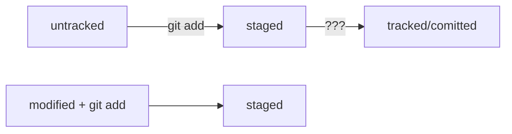

# Шпаргалка по Git

## Работа с Git

### Начало работы
- **```git init```** — создать локальный репозиторий в текущей папке
- **```rm -rf .git```** - удалили подпапку .git («Разгитить» папку)
- - **ключ ```-r```** (от англ. recursive — «рекурсивно») позволяет удалять папки вместе с их содержимым;
- - **ключ ```-f```** (от англ. force — «заставить») избавит вас от вопросов вроде «Вы точно хотите удалить этот файл? А этот? И этот тоже?».

### Последовательность действий с новым проектом

1. Создаем папку проекта локально
2. **```git init```**
3. Добавляем файлы проекта
4. **```git add -A```**
5. **```git commit```**
6. Создаем удаленный репозиторий (например, на GitHub)
7. **```git remote add origin <ссылка на удаленый репозиторий>```** — связываем локальный и удаленный репозитории (удаленный будет называться origin)
8. **```git remote -v```** - убедиться, что локальный и удаленный репозитории связаны
9. **```git push -u origin master```** - отправляем первый коммит в ветку master удаленного репозитория + фиксируем сокращенную команду **```git push```**, чтобы не добавлять каждый раз origin master

### Последовательность действий при подключении к существующему проекту

1. Создаем папку проекта локально
2. **```git clone <ссылка на удаленный репозиторий> <ссылка на локальный репозиторий```** - клонируем удаленный репозиторий (создастся новая папка)
3. **```git remote show <remote>```** - для получения удаленных веток и дополнительной информации из удаленного репозитория:
4. **```git pull```** - тоже самое что git fetch + git merge (загрузить коммиты, файлы и ссылки из удаленного репозитория + сделать их слияние с текущей веткой)

### Работа с изменениями
- **```git status```** — Проверить состояние репозитория
- **```git status --ignored```** — отобразить также игнорируемые файлы
- **```git add file.txt```** — добавить в индекс файл file.txt (подготовить к коммиту)
- **```git add --all```** — добавить в индекс все измененные файлы/папки (подготовить к коммиту)
- **```git add dir```** — добавить в индекс папку dir (подготовить к коммиту)
- **```git add .```** — добавить в индекс все измененные файлы/папки в текущей папке (подготовить к коммиту)
- **```git commit -m 'Описание коммита'```** - зафиксировать изменения (закоммитить)
- **```git cm 'Описание коммита'```** - краткая версия git commit -m 'Описание коммита'
- **```git push origin master```** - отправить новые коммиты в ветку master удаленного репозитория origin
- **```git log```** - посмотреть историю коммитов
- **```git log --oneline```** - Получить сокращённый лог (первые несколько символов хеша каждого коммита и их комментарии)
- **```git diff <хэш коммита А> <хэш коммита B>```** - Сравнить коммит А и коммит B. Вывести изменения.
	- **```git diff <хэш коммита А> HEAD```** - Сравнить коммит А и текущее соcтояние репозитория. Вывести изменения.
- **```git diff```** - Сравнить актуальную версию с последними сделанными изменениями (не переведенными в статус staged)
- **```git diff --staged```** - то же самое для изменений, переведенных в статус staged
- **```git diff <path to file> <path to file>```** - просмотреть различия между коммитами
- **```git diff <название_ветки1> <название_ветки2>```** - посмотреть различия между 2мя ветками
- **```git diff origin/master```** - сравним локальную ветку с обновленной удаленной веткой, чтобы увидеть различия:
- **```git fetch```** - получить коммиты, файлы и ссылки текущий репозиторий. Команда не вынуждает выполнять слияние изменений с текущим репозиторием.
- **```git fetch --dry-run```** - проверяем работу git fetch без дальнейшего обновления каких-либо локальных веток (для теста и просмотра изменений, которые будут получены в результате выполнения git fetch)
- **```git branch <название ветки>```** - создать новую ветку

### Ветвление

- **```git branch <название ветки>```** - создать новую ветку
- **```git checkout <название ветки>```** - переключиться на ветку (файлы и папки в репозитории изменятся до стстояния этой ветки)
- **```git checkout -b <название ветки>```** — создать новую ветку и переключение на нее
- **```git merge source```** - влить ветку source в текущую ветку
- **```git checkout branch -- folder```** - извлечь отдельный файл/папку folder из другой ветки и получить его, предварительно перейдя в ту ветку, куда вы собираетесь перенести файл (branch)
- **```git branch -D source```** - удалить ветку source
- **```git branch -d source```** - удалить ветку source только если она была полностью объединена с другой (более безопасный вариант)

### Восстановление
- **```git restore --staged <file>```** - Выполнить unstage изменений (если файл(ы) уже добавлен(ы) в индекс через git add, но нужно исключить их из ближайшего коммита) = сменить статус из staged обратно в untracked/modified.
- **```git restore <file>```** - «Откатить» изменения, которые не попали ни в staging, ни в коммит. Изменения в файле «откатятся» до последней версии, которая была сохранена через git commit или git add.
- **```git reset --hard <commit hash>```** - «Откатить» коммит (вернуть состояние репозитория к более раннему). Вместо <commit hash> нужно указать hash коммита, к которому нужно откатиться.

### .gitignore

- работает только для новых (untracked) файлов
- file.txt - будут проигнорированы все файлы file.txt во всех папках, включая вложенные
- ```*``` - любая строка, включая пустую. Например ```*.jpeg``` - проигнорировать все файлы с расширением .jpeg
- ```**``` - аналогично, но запись ```docs/*/tmp``` позволит указать только 1 вложенную папку, а ```docs/**/tmp``` - сколько угодно вложенных папок между docs и tmp.
- ```?``` - 1 любой символ
- ```[…]``` - 1 любой символ из списка в скобках. Например, file[0-2].txt
- ```/``` - указание на каталог. ```/file.txt``` — будет проигнорирован file.txt только в корне. ```name/``` — будет проигнорировано, если name - это папка, а не файл.
- ```!``` - не игнорировать


### SSH

- **```ssh-keygen -t ed25519 -C "электронная почта, к которой привязан ваш аккаунт на GitHub"```** — cгенерировать SSH-ключи
- **```ssh-keygen -t rsa -b 4096 -C "электронная почта, к которой привязан ваш аккаунт на GitHub" ```** — cгенерировать SSH-ключи (альтернативный вариант)
- **```pbcopy < ~/.ssh/id_ed25519.pub```** - скопировать содержимое ключа id_ed25519.pub в буфер обмена
- Добавляем ключ в GitHub: аватарка / Settings / SSH and GPG keys / New SSH key
 - **```ssh -T git@github.com```** - Проверить правильность ключа для GitHub

## Статусы
- **untracked** - неотслеживаемый
- **staged** - подготовленный (войдет в коммит)
- **modified** - измененн, но не подготовлен к добавлению в следующий коммит
- **tracked** - все отслеживаемые файлы



## Прочее

- HEAD — файл в папке .git, в котором записана ссылка (или ссылка на ссылку) на последний коммит. Это синоним хеша последнего коммита — его можно передавать командам Git в качестве параметра.
- [Документация по разметке Meramid](https://github.blog/2022-02-14-include-diagrams-markdown-files-mermaid/)
- **```git commit --amend --no-edit```** - Исправить последний коммит (дополнить новыми staged файлами или обновить исправленный отправленный файл). ```--amend``` - дополнение последнего коммита вместо создания нового. ```--no-edit``` - оставить сообщение коммита баз изменений.
- **```git commit --amend -m "Новое сообщение"```** - Изменить сообщение коммита

## Базовые команды в консоли

### Навигация

- **```pwd```** — покажи, в какой я папке;
- **```ls```** — покажи файлы и папки в текущей папке;
- **```ls -a```** — покажи также скрытые файлы и папки, названия которых начинаются с символа .;
- **```cd папка```** — перейди в папку "папка";
- **```cd папка/html```** — перейди в папку html, которая находится в папке "папка";
- **```cd ..```** — перейди на уровень выше, в родительскую папку;
- **```cd ~```** — перейди в домашнюю директорию (/Users/Username);
- **```cd /```** — перейди в корневую директорию.

## Работа с файлами и папками

### Создание

- **```touch index.html```** — создай файл index.html в текущей папке;
- **```touch index.html style.css script.js```** — если нужно создать сразу несколько файлов, можно напечатать их имена в одну строку через пробел;
- **```mkdir second-project```** — создай папку с именем second-project в текущей папке.

### Копирование и перемещение

- **```cp file.txt ~/my-dir```** — скопируй файл в другое место (~/my-dir);
- **```mv file.txt ~/my-dir```** — перемести файл или папку в другое место (~/my-dir).

### Чтение

- **```cat file.txt```** — распечатай (покажи) содержимое текстового файла file.txt.

### Изменение

- **```echo "Текст, который хотим дописать в файл" >> file.txt```** - дописать в file.txt новый текст 
- **```echo "Новый текст, который хотим записать в файл" > file.txt```** - записать в file.txt новый текст, предыдушее содержимое сотрется

### Удаление

- **```rm about.html```** — удали файл about.html;
- **```rmdir images```** — удали папку images;
- **```rm -r second-project```** — рекурсивное удаление = удали папку second-project и всё, что она содержит.

### Полезные возможности

 - Команды необязательно печатать и выполнять по очереди. Можно указать их списком — разделить двумя амперсандами (&&).
 - У консоли есть собственная память — буфер с несколькими последними командами. По ним можно перемещаться с помощью клавиш со стрелками вверх (↑) и вниз (↓).
 - Чтобы не вводить название файла или папки полностью, можно набрать первые символы имени и дважды нажать Tab. Если файл или папка есть в текущей директории, командная строка допишет путь сама.
Например, вы находитесь в папке dev. Начните вводить cd first и дважды нажмите Tab. Если папка first-project есть внутри dev, командная строка автоматически подставит её имя. Останется только нажать Enter.